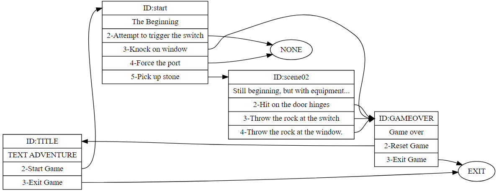

# Text adventure game engine

A simple text adventure game engine written in c++.
The game is read from a JSON file and then stored in memory using hash tables.
A .dot file is also generated , so you can see all game routes. 

## Compiling

You can compile the project by using :
 `g++ -o game.exe main.cpp src/game.cpp src/json.cpp src/structs.cpp src/xdot.cpp`

## Visualization 

You can visualize the game routes by using https://dreampuf.github.io/GraphvizOnline/
Or any kind of graph visualization tool that supports DOT files. 

